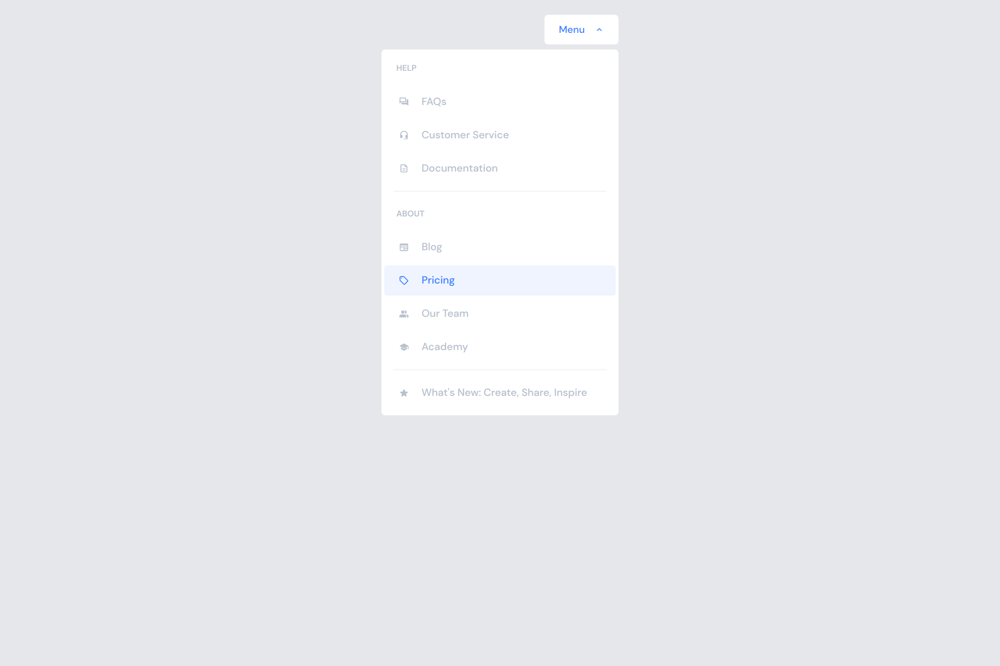

# Dropdown Menu 📑

  

<h2 align="center">
  <a href="https://nightrunner4.github.io/drop-down-menu">👉 Demo</a>
</h2>

### About 📖

Assignment of the JavaScript chapter in [The Odin Project](https://www.theodinproject.com). More practice of the techniques we've already been learning in the course

### Resources Used 📚

- [Dribbble - Murat Alpay](https://dribbble.com/shots/15582954-Little-Big-Details-1-Menu-Drop) (UI Inspo)
- [Google Fonts](https://fonts.google.com) (Icons & Font)
- [EmojiTerra](https://emojiterra.com/) (Emojis)

### Built With 🛠️

- JS
- CSS
- HTML
